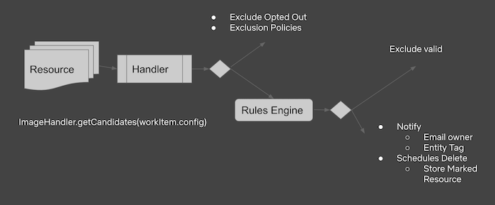

# Swabbie

_**IMPORTANT:** This service is currently under development, and is actively being used at Netflix for deleting images, 
ebs snapshots and auto scaling groups._

Swabbie automates the cleanup of unused resources such as EBS Volumes and Images.
As a Janitor Monkey replacement, it can also be extended to clean up a variety of resource types.
Swabbie applies a set of rules to mark cleanup candidates. 
Once marked, a resource is scheduled for deletion, and an owner is notified.
Before being deleted the resource is checked again to make sure it still qualifies for deletion.
If so, it is deleted.

## Deep Dive

For a more detailed understanding of how Swabbie works, visit [the internals doc](INTERNALS.md).

## How it works


During initialization swabbie schedules work to routinely mark, notify and delete resources.
The application configuration is flattened into work items that are placed on the work queue for processing:

*YAML config -> Work Items -> Work Queue*


Each visited resource is evaluated against the **rules engine** in order to determine if it should be deleted. 

**Rules** in the rules engine are configurable and can be composed similar to an `if/else` branch.
They can be defined with an `AND` (`&&`), or `OR` (`||`) operator:
 
- `AND`: A branch applies if all contained rules apply to the resource being evaluated.
- `OR`: A branch applies if any rule contained inside the branch applies.

```yaml
resourceTypes:
- name: serverGroup
  enabled: true
  enabledRules:
  - operator: AND # branch(1)
    description: Empty Server Groups that have been disabled for more than than 45 days.
    rules:
      - name: ZeroInstanceRule
      - name: DisabledLoadBalancerRule
        parameters:
          moreThanDays: 45
  - operator: OR #branch(2)
    description: Expired Server Groups.
    rules:
      - name: ExpiredResourceRule
```

The above configuration translates to the following: 

For every resource **r** of type serverGroup,

* `r.marked == true => (branch(1) || branch(2)) == true`

Or more generally:
 
* `r.marked == true => (branch(1) || branch(2) || ... branch(n-1) || branch(n)) == true`

As illustrated using defined rules:
 
`if (((ZeroInstanceRule && DisabledLoadBalancerRule) || ExpiredResourceRule) == true)`
##### Resource States:
- **Marked**:



During the marking process, previously marked resources that no longer qualify for deletion are Unmarked.

- **Notified**:
Once marked, the resource owner is resolved and notified about the upcoming deletion.

- **Opted-Out**:
A resource can be explicitly opted out of deletion via API or **exclusion policies**. 
Opted out resources are exempt from swabbie actions. 

- **Deleted**:


Resources are re-evaluated before deletion to ensure they can be safely deleted.

### What's supported today
- Cloud Provider: AWS
  * Netflix uses Edda
  * Vanilla AWS is also supported
- Resource Types:
  * AMIs
  * Server Groups
  * Launch Configurations
  * EBS Snapshots
  * ELBs
- Halyard: Not supported yet (PRs are welcome!)
  
## Contributing
If you're interested in contributing support for other providers or resource types, open an issue or join 
the Spinnaker Team slack and post in #swabbie.

Areas:
- Testing
- Documentation
- Other cloud provider
- Extensibility
- Plugin support
 
## Running swabbie
Requirements: 
- Redis for storage 
- Copy config file to a directory of your choice [Configuration](docs/swabbie.yml) (maps to [SwabbieProperties](swabbie-core/src/main/kotlin/com/netflix/spinnaker/config/SwabbieProperties.kt))
- Update config with your settings and run

`./gradlew run -Dspring.config.location=/absolute/path/to/swabbie.yml`


